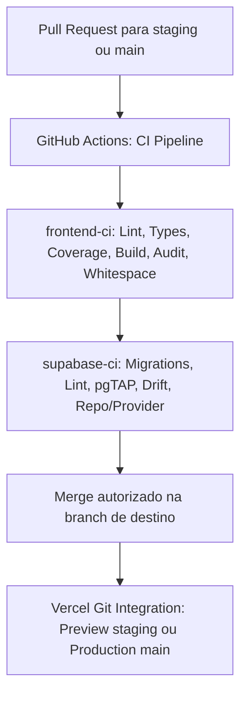

# 🚀 Guia de Deploy e Operação Contínua (FinControl V38)

Este guia documenta os procedimentos oficiais de provisionamento, CI/CD, deploy e operação do **FinControl V38** no **Supabase Cloud** e na **Vercel**.

---

## 1. Arquitetura e Ambientes

O FinControl V38 adota separação estrita de ambientes:

| Parâmetro | Staging (Homologação) | Production (Produção) |
| :--- | :--- | :--- |
| **Projeto Supabase** | `fincontrol-staging` (`iwesoczokkycjovyknnz`) | `fincontrol-production` |
| **Host Vercel** | `staging.fincontrol.app` (ou preview branch) | `fincontrol.app` |
| **`NEXT_PUBLIC_DATA_MODE`** | `supabase` | `supabase` |
| **Deploy de Migrações** | Automatizado via CLI / GitHub Actions | Pipeline restrito com aprovação manual |
| **Agendamento Cron** | Diário às 03:00 UTC via `pg_cron` | Diário às 03:00 UTC via `pg_cron` |
| **Isolamento de Dados** | Usuários e workspaces de homologação | Dados reais dos clientes |

---

## 2. Configuração do Backend no Supabase

### 2.1. Gestão de Migrações (001 a 034)
As alterações no schema do banco são aplicadas exclusivamente via **Supabase CLI** de forma *forward-only*:
```bash
# 1. Vincular ao projeto remoto desejado (Staging ou Produção)
npx supabase link --project-ref <PROJECT_REF>

# 2. Verificar o status e sincronismo das migrações
npx supabase migration list

# 3. Aplicar migrações pendentes (001 a 034)
npx supabase db push --linked --skip-vault
```

> [!IMPORTANT]
> **Nunca execute DDL manual pelo SQL Editor em produção.** Todas as modificações estruturais de tabelas, funções, triggers e políticas RLS devem ser versionadas na pasta `supabase/migrations/` e aplicadas via CLI ou CI. O comando `supabase db push` **não executa o seed.sql** em bancos remotos vinculados, garantindo a criação de um schema de produção estritamente limpo e sem dados de demonstração.

### 2.2. Políticas de Segurança e Princípio do Menor Privilégio (Migrations 029 a 034)
- **Row Level Security (RLS)**: Habilitada em 100% das tabelas públicas. Nenhuma consulta anônima ou não autorizada acessa dados de outro workspace.
- **Revogação Total de TRUNCATE, TRIGGER e REFERENCES**: Nenhuma role de cliente (`authenticated`, `anon`, `PUBLIC`) possui privilégio `TRUNCATE` em qualquer tabela, eliminando o risco de contorno de RLS via comandos DDL.
- **Tabelas Financeiras com Mutações Exclusivas por RPCs (Migration 030)**: `payments`, `transfers`, `transactions` e `purchases` unem-se a `credit_card_bills`, `installments`, `transaction_splits` e `purchase_splits` como estritamente **Somente Leitura (`SELECT`)** para `authenticated`. Escritas diretas (`INSERT`, `UPDATE`, `DELETE`) pelo cliente são revogadas na camada de permissões (erro 42501). Todas as mutações financeiras são orquestradas obrigatoriamente pelas RPCs atômicas `SECURITY DEFINER` (`fn_record_payment`, `fn_create_transfer`, `fn_create_transaction_with_splits`, `fn_create_purchase_with_splits`, etc.), impedindo que exclusões ou alterações contornem a reconciliação de saldos e quitação de obrigações.
- **Perfis de Usuário (`profiles`)**: Acesso restrito a `SELECT` e `UPDATE` para `authenticated`. Inserções e deleções diretas pelo cliente são proibidas (gerenciadas pelo trigger `handle_new_user()` e cascata de deleção do `auth.users`).
- **Restrição de Execução em Triggers**: As 23 trigger functions do schema `public` têm `EXECUTE` expressamente revogado de `authenticated`, `anon` e `PUBLIC`, sendo invocáveis unicamente pela engine interna do PostgreSQL.
- **Revogação Abrangente de Privilégios Padrão (Global e Schema)**: `ALTER DEFAULT PRIVILEGES` revogados tanto no nível global (sem especificação de schema) quanto no schema `public` para tabelas, rotinas e sequências no role `postgres`.
- **Catálogo de Objetos Gerenciados e Blindagem sem Silenciamento (Migration 032)**:
  - **Catálogo Interno (`public._db_managed_objects`)**: Tabela protegida por RLS que rastreia os objetos do schema `public`. Permite distinguir com precisão matemática comandos de criação de objetos novos de comandos de alteração ou substituição de objetos existentes (`ALTER TABLE`, `CREATE OR REPLACE VIEW`, `CREATE OR REPLACE FUNCTION`).
  - **Preservação de Grants em Substituição**: Comandos `ALTER TABLE`, `CREATE OR REPLACE VIEW` e `CREATE OR REPLACE FUNCTION` detectam que o objeto já é gerenciado (com identificadores canônicos sincronizados via `pg_identify_object` na migration 033) e **não** reexecutam revogações, mantendo preservados todos os grants concedidos a `authenticated`.
  - **Verificação Ativa Pós-Revogação e Fail-Closed (Migration 034)**: O event trigger `trg_lockdown_new_objects` **não** se limita a disparar `REVOKE ALL`. Imediatamente após a revogação, o trigger inspeciona ativamente o estado real dos privilégios via `has_table_privilege`, `has_function_privilege` e `has_sequence_privilege`. Se qualquer privilégio indevido permanecer ativo para `anon` ou `authenticated` (por exemplo, grants emitidos por superuser ou default privileges que o executor não tem autoridade para revogar, gerando apenas avisos do PostgreSQL), o trigger aborta o DDL com `RAISE EXCEPTION`. Nenhum objeto novo pode nascer exposto.
  - **Limpeza no DROP (`trg_unmanage_dropped_objects`)**: Event trigger em `sql_drop` remove do catálogo os objetos excluídos, assegurando que, caso sejam recriados, voltem a nascer privados por padrão.
- **Isolamento de `supabase_admin` e Configuração de Plataforma Supabase**:
  - No PostgreSQL gerenciado do Supabase, `postgres` opera de forma estritamente isolada e não é superusuário nem membro de `supabase_admin` (comprovado pelo erro `42501` em tentativas de `SET ROLE supabase_admin`, `ALTER TABLE ... OWNER TO supabase_admin` e `ALTER DEFAULT PRIVILEGES FOR ROLE supabase_admin`).
  - **Caminho de DDL direto como `supabase_admin`**: O Supabase Cloud não expõe credenciais de login para a role superuser `supabase_admin` em conexões de banco de dados ou pipelines de migração (o acesso é restrito à infraestrutura interna da plataforma). Portanto, o caminho de criação direta de DDL logado como `supabase_admin` é classificado formalmente como **não homologado via cliente/migração**. A segurança contra esse cenário é garantida pelo event trigger (034), que cancela qualquer DDL caso privilégios automáticos de `supabase_admin` permaneçam após o REVOKE.
  - A proteção completa de defesa em profundidade é garantida pela combinação de:
    1. **Configurações do Projeto Supabase**:
       - *Exposição de novas tabelas na Data API*: **Desligada** (*Disabled* no painel em *Project Settings $\rightarrow$ API*). Tabelas criadas por qualquer ferramenta administrativa não são expostas ao PostgREST sem autorização explícita;
       - *RLS Automático em novas tabelas*: **Ligada** (*Enabled* no painel em *Project Settings $\rightarrow$ Database*). Qualquer tabela nova recebe RLS ativado com política padrão de negação (*deny-all*).
    2. **DEFAULT ACLs do `postgres`**: Todas as tabelas e rotinas criadas por migrations (executadas como `postgres`) nascem sem privilégios para `anon` ou `authenticated`.
    3. **Event Trigger Refinado com Verificação Ativa (034)**: Revoga privilégios e valida ativamente a ausência de grants em qualquer nova tabela, view, sequence ou rotina criada em `public`, falhando ruidosamente (`RAISE EXCEPTION`) diante de qualquer violação.

### 2.3. Guia de Aplicação e Validação no Projeto Vazio de Produção

Siga este procedimento passo a passo para inicializar o banco de produção com isolamento completo e sem sementes locais:

1. **Obter as Credenciais do Novo Projeto de Produção**:
   - `PROD_PROJECT_REF`: Referência do projeto de produção (obtida em *Project Settings $\rightarrow$ General*);
   - `SUPABASE_DB_PASSWORD`: Senha configurada na criação do banco de produção.

2. **Vincular o CLI ao Projeto de Produção**:
   ```bash
   # Vincular ao banco de produção
   npx supabase link --project-ref <PROD_PROJECT_REF>
   ```

3. **Verificar a Fila de Migrações (Dry-Run)**:
   ```bash
   # Confere que as migrations 001 a 034 constam como locais e nenhuma remota
   npx supabase migration list
   ```

4. **Aplicar Todas as Migrações (001 a 034) de Forma Limpa**:
   ```bash
   # Aplica o schema completo sem executar seed.sql
   npx supabase db push --linked --skip-vault
   ```

5. **Executar Validação Estrutural e de Privilégios em Produção**:
   ```bash
   # 5.1. Validar que todas as 34 migrations foram registradas
   npx supabase migration list

   # 5.2. Executar Lint de Schema remoto
   npx supabase db lint --linked --schema public --level error --fail-on error

   # 5.3. Validar ausência total de dados de demonstração
   npx supabase db query --linked "
     SELECT 'workspaces' as tabela, count(*) as total FROM public.workspaces
     UNION ALL
     SELECT 'profiles', count(*) FROM public.profiles
     UNION ALL
     SELECT 'transactions', count(*) FROM public.transactions;
   "
   # Esperado: 0 registros em todas as tabelas.

   # 5.4. Validar privilégios bloqueados para anônimo, truncate e escritas financeiras diretas
   npx supabase db query --linked "
     SELECT
       (SELECT count(*) FROM information_schema.table_privileges WHERE table_schema = 'public' AND grantee = 'anon') as anon_privileges,
       (SELECT count(*) FROM information_schema.table_privileges WHERE table_schema = 'public' AND grantee = 'authenticated' AND privilege_type = 'TRUNCATE') as truncate_privileges,
       (SELECT count(*) FROM information_schema.table_privileges WHERE table_schema = 'public' AND grantee = 'authenticated' AND table_name IN ('payments', 'transfers', 'transactions', 'purchases') AND privilege_type IN ('INSERT', 'UPDATE', 'DELETE')) as direct_financial_write_privileges;
   "
   # Esperado: anon_privileges = 0, truncate_privileges = 0, direct_financial_write_privileges = 0.
   ```

6. **Reconectar o CLI ao Projeto de Staging**:
   ```bash
   # Retorna o ambiente de desenvolvimento/staging para a ref original
   npx supabase link --project-ref iwesoczokkycjovyknnz
   ```

### 2.4. Agendamento de Recorrências (`pg_cron`)
A materialização de transações recorrentes é realizada automaticamente pela extensão `pg_cron` configurada na Migration 023 e endurecida nas Migrations 027/028:
```sql
SELECT cron.schedule(
    'fincontrol-materialize-recurring-daily',
    '0 3 * * *',
    'SELECT public.fn_materialize_recurring_transactions();'
);
```
*Nota: A RPC `fn_materialize_recurring_transactions(p_workspace_id UUID DEFAULT NULL, p_target_date DATE DEFAULT CURRENT_DATE)` processa, por padrão, todos os workspaces até a data atual. O limite de 30 dias futuros restringe chamadas de usuários autenticados; o cron diário não antecipa ocorrências.*

---

## 3. Variáveis de Ambiente e Separação de Ambientes

As variáveis devem ser configuradas de forma estritamente isolada no painel da Vercel para cada ambiente (*Preview* vs *Production*):

| Variável | Escopo Vercel | Descrição | Exemplo |
| :--- | :--- | :--- | :--- |
| `NEXT_PUBLIC_SUPABASE_URL` | Preview (Staging) | URL do projeto Supabase Staging | `https://iwesoczokkycjovyknnz.supabase.co` |
| `NEXT_PUBLIC_SUPABASE_URL` | Production | URL do projeto Supabase Produção | `https://<PROD_REF>.supabase.co` |
| `NEXT_PUBLIC_SUPABASE_PUBLISHABLE_KEY` | Preview (Staging) | Chave anon/publishable de Staging | `sb_publishable_staging_...` |
| `NEXT_PUBLIC_SUPABASE_PUBLISHABLE_KEY` | Production | Chave anon/publishable de Produção | `sb_publishable_prod_...` |
| `NEXT_PUBLIC_DATA_MODE` | Preview e Prod | Modo forçado Supabase | `supabase` |
| `NEXT_PUBLIC_SITE_URL` | Preview (Staging) | Domínio de Staging | `https://staging.fincontrol.app` |
| `NEXT_PUBLIC_SITE_URL` | Production | Domínio de Produção | `https://app.fincontrol.com.br` |

> [!CAUTION]
> **Nunca aponte o ambiente de Produção da Vercel para o novo banco de dados antes da homologação formal e autorização desta auditoria.** Além disso, nenhuma chave `service_role` ou senha de banco de dados deve ser exposta no frontend nem prefixada com `NEXT_PUBLIC_`. As credenciais administrativas residem exclusivamente nos secrets do GitHub Actions ou cofre seguro, jamais em variáveis expostas ao cliente.

---

## 4. Pipeline de CI/CD (GitHub Actions) e Integração Vercel

O pipeline automatizado em `.github/workflows/ci.yml` executa a validação rigorosa de qualidade do frontend e integridade do banco Supabase Cloud:
- **Gatilhos sem duplicação**: Disparado em `push` na branch `main` e em `pull_request` direcionados para `staging` ou `main`. Branches de feature com PR aberto disparam a suíte uma vez por commit e destino;
- **Promoção controlada**: A integração Git da Vercel pode criar Previews antes do término do CI. Configure regras de proteção em `staging` e `main` que exijam `frontend-ci` e `supabase-ci` antes do merge. Se desejar segurar a atribuição do domínio de produção após o build, configure também os Deployment Checks no Vercel. Essas configurações precisam ser verificadas no GitHub e no Vercel; o workflow sozinho não as ativa.



### 4.1. Jobs Executados

1. **`frontend-ci`**:
   - `npm run typecheck`: Validação estrita do compilador TypeScript;
   - `npm run lint`: Verificação de regras ESLint e memoização do React Compiler;
   - `npm run test:coverage`: Execução dos 498 testes unitários/provider locais com metas de cobertura ($\ge 99,50\%$ Stmts/Lines, $\ge 97,00\%$ Branches, $100\%$ Funcs);
   - `npm run build`: Compilação de produção com Next.js 16 App Router e Turbopack (19 rotas);
   - `npm audit`: Análise de vulnerabilidades em dependências;
   - `git diff --check`: Inspeção do intervalo do PR ou push para detectar espaços finais e erros de whitespace.

2. **`supabase-ci`**:
   - `npx supabase migration list --output-format json`: Confirma que cada migration local corresponde a uma migration aplicada no banco remoto;
   - `npx supabase db lint --linked`: Lint de schema PostgreSQL contra o projeto vinculado;
   - `npm run test:db:cloud`: Execução das 124 asserções de banco via pgTAP contra o Staging;
   - `npx supabase gen types ... && git diff --exit-code`: Detecção de type drift no `database.types.ts`;
   - `npm run test:repo:cloud`: Suíte de integração com 35 testes reais contra o Supabase Cloud.

---

## 5. Deploy do Frontend na Vercel

### 5.1. Conexão do Repositório
1. Acesse o painel da **[Vercel](https://vercel.com)** e importe o repositório `fincontrol-app`;
2. Configure o framework como **Next.js**;
3. Configure a branch de produção como `main`;
4. Use `staging` como branch estável de Preview e associe suas variáveis públicas ao projeto Supabase `fincontrol-staging`. Novas features independentes partem de `main`; somente mudanças escolhidas para a próxima entrega entram em `staging`;
5. Faça PR de `staging` para `main` apenas quando todo o conteúdo de `staging` estiver aprovado. Para promover uma feature isolada, abra seu PR diretamente para `main` após validá-la no Preview.

### 5.2. Verificação de Saúde Pós-Deploy (Smoke Tests)
Após a conclusão do deploy na Vercel:
1. Acesse a URL gerada e valide o redirecionamento automático para `/auth/login` caso não haja sessão;
2. Execute o fluxo de login ou registro via token OTP/senha;
3. Confirme que o workspace inicial (`Minhas Finanças`) é carregado com UUID real do PostgreSQL;
4. Crie uma despesa avulsa e uma transferência entre contas, conferindo a atualização instantânea de saldo e recálculo de competência no Dashboard.

---

## 6. Procedimento de Rollback

### Frontend
- Na Vercel, utilize a opção **"Instant Rollback"** para apontar o tráfego imediatamente para o deployment anterior aprovado;
- Em homologação, restaure o último deployment aprovado do Preview e mantenha `NEXT_PUBLIC_DATA_MODE=supabase` para preservar a referência aos dados do staging.

### Banco de Dados
- Migrações são estritamente *forward-only* em produção. Em caso de necessidade de reversão, crie uma migration corretiva subsequente (ex: `029_v38_revert_...`);
- Antes de qualquer operação destrutiva em produção, realize backup pontual via Supabase Dashboard (**Database > Backups**).
