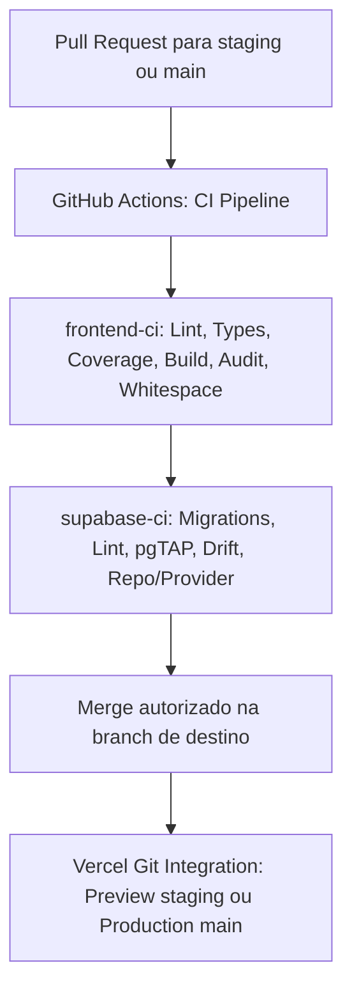

# 🚀 Guia de Deploy e Operação Contínua (FinControl V38)

Este guia documenta os procedimentos oficiais de provisionamento, CI/CD, deploy e operação do **FinControl V38** no **Supabase Cloud** e na **Vercel**.

---

## 1. Arquitetura e Ambientes

O FinControl V38 adota separação estrita de ambientes:

| Parâmetro | Staging (Homologação) | Production (Produção) |
| :--- | :--- | :--- |
| **Projeto Supabase** | `fincontrol-staging` (`iwesoczokkycjovyknnz`) | `fincontrol-production` |
| **Host Vercel** | `staging.fincontrol.app` (ou preview branch) | `fincontrol.app` |
| **`NEXT_PUBLIC_DATA_MODE`** | `supabase` | `supabase` |
| **Deploy de Migrações** | Automatizado via CLI / GitHub Actions | Pipeline restrito com aprovação manual |
| **Agendamento Cron** | Diário às 03:00 UTC via `pg_cron` | Diário às 03:00 UTC via `pg_cron` |
| **Isolamento de Dados** | Usuários e workspaces de homologação | Dados reais dos clientes |

---

## 2. Configuração do Backend no Supabase

### 2.1. Gestão de Migrações (001 a 028)
As alterações no schema do banco são aplicadas exclusivamente via **Supabase CLI** de forma *forward-only*:
```bash
# 1. Vincular ao projeto remoto
npx supabase link --project-ref <PROJECT_REF>

# 2. Verificar o status e sincronismo das migrações
npx supabase migration list

# 3. Aplicar migrações pendentes
npx supabase db push --linked
```

> [!IMPORTANT]
> **Nunca execute DDL manual pelo SQL Editor em produção.** Todas as modificações estruturais de tabelas, funções, triggers e políticas RLS devem ser versionadas na pasta `supabase/migrations/` e aplicadas via CLI ou CI.

### 2.2. Políticas de Segurança e Privilégios Mínimos
- **Row Level Security (RLS)**: Habilitada em 100% das tabelas públicas. Nenhuma consulta anônima ou não autorizada acessa dados de outro workspace.
- **Faturas e Parcelas Subordinadas**: Revogação total (`REVOKE ALL`) de privilégios de escrita em `credit_card_bills` e `installments` para `authenticated`, `anon` e `PUBLIC`. O gerenciamento é feito exclusivamente por RPCs atômicas com locks determinísticos.
- **SECURITY DEFINER**: RPCs e trigger functions sensíveis usam `search_path` explícito e privilégios adequados a cada função. O job de recorrências roda sob o papel `postgres`.

### 2.3. Agendamento de Recorrências (`pg_cron`)
A materialização de transações recorrentes é realizada automaticamente pela extensão `pg_cron` configurada na Migration 023 e endurecida nas Migrations 027/028:
```sql
SELECT cron.schedule(
    'fincontrol-materialize-recurring-daily',
    '0 3 * * *',
    'SELECT public.fn_materialize_recurring_transactions();'
);
```
*Nota: A RPC `fn_materialize_recurring_transactions(p_workspace_id UUID DEFAULT NULL, p_target_date DATE DEFAULT CURRENT_DATE)` processa, por padrão, todos os workspaces até a data atual. O limite de 30 dias futuros restringe chamadas de usuários autenticados; o cron diário não antecipa ocorrências.*

---

## 3. Variáveis de Ambiente

As seguintes variáveis devem ser configuradas no painel da Vercel para cada ambiente:

| Variável | Escopo | Descrição | Exemplo |
| :--- | :--- | :--- | :--- |
| `NEXT_PUBLIC_SUPABASE_URL` | Staging / Prod | URL da API REST do Supabase | `https://xxxx.supabase.co` |
| `NEXT_PUBLIC_SUPABASE_PUBLISHABLE_KEY` | Staging / Prod | Chave pública (`publishable` ou `anon`) | `sb_publishable_...` |
| `NEXT_PUBLIC_DATA_MODE` | Staging / Prod | Força o modo de dados para nuvem | `supabase` |
| `NEXT_PUBLIC_SITE_URL` | Staging / Prod | URL base canônica para redirects de Auth | `https://staging.fincontrol.app` |

> [!CAUTION]
> **Nenhuma chave `service_role` ou senha de banco de dados deve ser exposta no frontend** nem prefixada com `NEXT_PUBLIC_`. As credenciais administrativas residem exclusivamente em secrets do GitHub Actions.

---

## 4. Pipeline de CI/CD (GitHub Actions) e Integração Vercel

O pipeline automatizado em `.github/workflows/ci.yml` executa a validação rigorosa de qualidade do frontend e integridade do banco Supabase Cloud:
- **Gatilhos sem duplicação**: Disparado em `push` na branch `main` e em `pull_request` direcionados para `staging` ou `main`. Branches de feature com PR aberto disparam a suíte uma vez por commit e destino;
- **Promoção controlada**: A integração Git da Vercel pode criar Previews antes do término do CI. Configure regras de proteção em `staging` e `main` que exijam `frontend-ci` e `supabase-ci` antes do merge. Se desejar segurar a atribuição do domínio de produção após o build, configure também os Deployment Checks no Vercel. Essas configurações precisam ser verificadas no GitHub e no Vercel; o workflow sozinho não as ativa.



### 4.1. Jobs Executados

1. **`frontend-ci`**:
   - `npm run typecheck`: Validação estrita do compilador TypeScript;
   - `npm run lint`: Verificação de regras ESLint e memoização do React Compiler;
   - `npm run test:coverage`: Execução dos 498 testes unitários/provider locais com metas de cobertura ($\ge 99,50\%$ Stmts/Lines, $\ge 97,00\%$ Branches, $100\%$ Funcs);
   - `npm run build`: Compilação de produção com Next.js 16 App Router e Turbopack (19 rotas);
   - `npm audit`: Análise de vulnerabilidades em dependências;
   - `git diff --check`: Inspeção do intervalo do PR ou push para detectar espaços finais e erros de whitespace.

2. **`supabase-ci`**:
   - `npx supabase migration list --output-format json`: Confirma que cada migration local corresponde a uma migration aplicada no banco remoto;
   - `npx supabase db lint --linked`: Lint de schema PostgreSQL contra o projeto vinculado;
   - `npm run test:db:cloud`: Execução das 124 asserções de banco via pgTAP contra o Staging;
   - `npx supabase gen types ... && git diff --exit-code`: Detecção de type drift no `database.types.ts`;
   - `npm run test:repo:cloud`: Suíte de integração com 35 testes reais contra o Supabase Cloud.

---

## 5. Deploy do Frontend na Vercel

### 5.1. Conexão do Repositório
1. Acesse o painel da **[Vercel](https://vercel.com)** e importe o repositório `fincontrol-app`;
2. Configure o framework como **Next.js**;
3. Configure a branch de produção como `main`;
4. Use `staging` como branch estável de Preview e associe suas variáveis públicas ao projeto Supabase `fincontrol-staging`. Novas features independentes partem de `main`; somente mudanças escolhidas para a próxima entrega entram em `staging`;
5. Faça PR de `staging` para `main` apenas quando todo o conteúdo de `staging` estiver aprovado. Para promover uma feature isolada, abra seu PR diretamente para `main` após validá-la no Preview.

### 5.2. Verificação de Saúde Pós-Deploy (Smoke Tests)
Após a conclusão do deploy na Vercel:
1. Acesse a URL gerada e valide o redirecionamento automático para `/auth/login` caso não haja sessão;
2. Execute o fluxo de login ou registro via token OTP/senha;
3. Confirme que o workspace inicial (`Minhas Finanças`) é carregado com UUID real do PostgreSQL;
4. Crie uma despesa avulsa e uma transferência entre contas, conferindo a atualização instantânea de saldo e recálculo de competência no Dashboard.

---

## 6. Procedimento de Rollback

### Frontend
- Na Vercel, utilize a opção **"Instant Rollback"** para apontar o tráfego imediatamente para o deployment anterior aprovado;
- Em homologação, restaure o último deployment aprovado do Preview e mantenha `NEXT_PUBLIC_DATA_MODE=supabase` para preservar a referência aos dados do staging.

### Banco de Dados
- Migrações são estritamente *forward-only* em produção. Em caso de necessidade de reversão, crie uma migration corretiva subsequente (ex: `029_v38_revert_...`);
- Antes de qualquer operação destrutiva em produção, realize backup pontual via Supabase Dashboard (**Database > Backups**).
